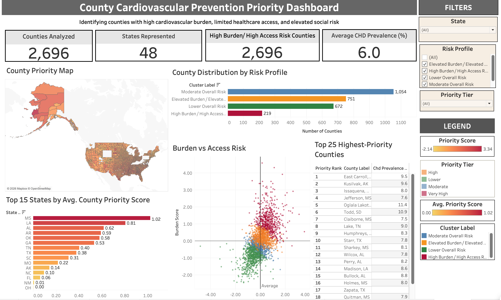

# County Cardiovascular Prevention Priority Dashboard

## County-Level Public Health Prioritization Using R, DuckDB SQL, and Tableau Public

An end-to-end public health analytics project that identifies U.S. counties with high cardiovascular disease burden, limited healthcare access, and elevated social risk. This project combines **CDC PLACES** and **County Health Rankings** data, uses **R** for cleaning and analysis, **DuckDB SQL** for querying, and **Tableau Public** for an interactive decision-support dashboard.

The final product is a county-level prioritization tool designed to help public health teams, healthcare analysts, and policy stakeholders quickly identify where cardiovascular prevention resources may be targeted first.

---

## Dashboard Preview

---

## Tools & Techniques Used

### Programming & Data Processing
- R
- tidyverse
- janitor
- DuckDB
- DBI

### Querying & Data Storage
- DuckDB SQL
- SQL filtering, ranking, aggregation, and subgroup analysis

### Visualization
- Tableau Public
- KPI cards
- county-level choropleth map
- ranking table
- scatterplot segmentation
- state comparison chart
- risk profile distribution chart

### Analytics Techniques
- county-level data cleaning and harmonization
- FIPS-based dataset merging
- exploratory data analysis
- descriptive public health risk stratification
- z-score standardization
- composite scoring
- county risk profile grouping

---

## About the Data

This project integrates two major public health datasets:

- **CDC PLACES 2025**
  - county-level estimates for chronic disease, prevention, health behaviors, disability, and health status

- **County Health Rankings 2025**
  - county-level indicators for healthcare access, clinical care, and social/economic conditions

### Key Variables Used

#### Cardiovascular / Chronic Disease Burden
- coronary heart disease prevalence
- stroke prevalence
- high blood pressure prevalence
- diabetes prevalence
- obesity prevalence
- smoking prevalence
- physical inactivity prevalence

#### Healthcare Access / Community Risk
- uninsured percentage
- primary care physician access
- preventable hospital stays
- child poverty percentage
- unemployment percentage

---

## Project Objectives

This project was designed to answer:

- Which U.S. counties have the highest combined burden of cardiovascular risk and healthcare access barriers?
- Which states contain the highest average-priority counties?
- How are counties distributed across interpretable public health risk profiles?
- Which counties should be reviewed first for cardiovascular prevention targeting?

---

## Key Project Metrics

- **Counties analyzed:** 2,699
- **States represented:** 49
- **High Burden / High Access Risk counties:** 219
- **Average CHD prevalence:** 6.0%

### Risk Profile Distribution
- **Moderate Overall Risk:** 1,054 counties
- **Elevated Burden / Elevated Access Risk:** 751 counties
- **Lower Overall Risk:** 672 counties
- **High Burden / High Access Risk:** 219 counties

---

## Key Findings

### Highest-Priority States by Average County Priority Score
The dashboard identified the following states as having the highest average county priority scores:

- Mississippi: **1.02**
- Louisiana: **0.81**
- Alabama: **0.62**
- Arkansas: **0.59**
- Oklahoma: **0.58**
- Georgia: **0.53**

### Example High-Priority Counties
The highest-priority counties included:

- East Carroll, LA
- Kusilvak, AK
- Issaquena, MS
- Jefferson, MS
- Oglala Lakota, SD
- Todd, SD

These counties emerged as high-priority because they combined elevated cardiovascular burden with access and/or social risk challenges.

---

## Methods

### Data Preparation
- downloaded and cleaned CDC PLACES county-level data in R
- downloaded and cleaned County Health Rankings data in R
- standardized county identifiers using 5-digit FIPS codes
- merged county-level datasets into a single analytic file

### Exploratory Analysis
- checked distributions, missingness, and variable coverage
- identified top burden counties
- reviewed state-level differences and summary trends
- exported selected visual and CSV outputs

### Scoring & Risk Stratification
- standardized burden, access, and social risk variables
- created county-level composite scoring components
- ranked counties by overall priority
- grouped counties into interpretable risk profiles for dashboard use

### SQL Layer
- stored the final analytic file in DuckDB
- wrote SQL queries for:
  - county rankings
  - state summaries
  - high-risk county subsets

### Dashboard Development
Built an interactive Tableau dashboard with:
- KPI summary cards
- county priority map
- top 15 states comparison
- risk profile distribution
- burden vs access risk scatterplot
- top 25 highest-priority counties table

---

## Dashboard Views

### County Priority Map
A national county-level map showing where priority counties are concentrated geographically.

### Top 15 States by Average County Priority Score
Highlights states with the highest average county-level prevention priority.

### County Distribution by Risk Profile
Shows how many counties fall into each risk profile category.

### Burden vs Access Risk
Plots counties by combined burden and access dimensions to show clustering and separation across profiles.

### Top 25 Highest-Priority Counties
Provides a concise ranked shortlist of high-priority counties with CHD prevalence for quick review.

---

## Why This Project Matters

This project reflects the type of work performed in public health analytics, healthcare strategy, and population health planning.

It demonstrates how county-level data can be used to support:

- prevention resource prioritization
- geographic targeting
- health equity review
- access gap identification
- leadership-facing dashboard communication

Rather than claiming causality, the dashboard serves as a **descriptive screening and prioritization tool** for public health decision support.

---

## What’s Included in This Repository

- cleaned county-level datasets
- R scripts for loading, cleaning, merging, analysis, and scoring
- DuckDB database and SQL analysis queries
- selected output files and charts
- Tableau workbook
- dashboard preview image
- project documentation

---

**## Tableau Dashboard**
Tableau Public Link: https://public.tableau.com/app/profile/sowmya.deshpande8412/viz/County_CVD_Priority_Dashboard/Dashboard1?publish=yes

---

**## Limitations**
1. analysis is county-level and ecological, not individual-level
2. prioritization scores are descriptive, not causal
3. rankings depend on variable selection and scoring choices
4. some access variables contain missingness that may affect county profiles

---

**## About Me**
Created by **Sowmya Deshpande**
Healthcare Data Analyst | Public Health Analytics | R • SAS • SQL • Power BI • Excel • Tableau | Population Health | Survey Analytics | Healthcare Business Intelligence | NYC DOHMH
[LinkedIn](www.linkedin.com/in/sowmyadeshpande) | [GitHub](https://github.com/DeshpandeSowmya)
